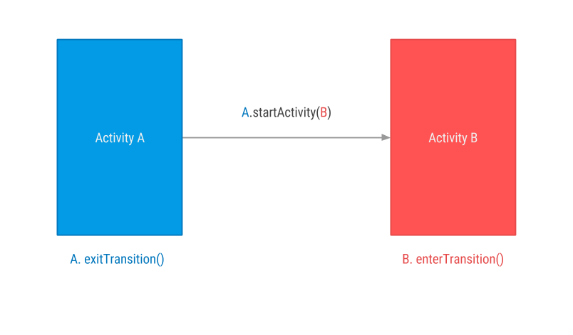
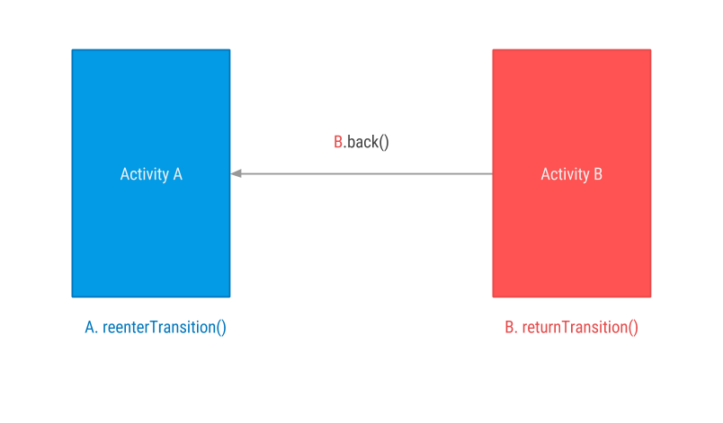

# HollyTransition
深入解读Android过场动画、共享元素、场景动画


### 内容过程动画
> 对内容过场动画比较重要的几个函数,下面这种图比较形象地描述这个关系。Activity和Fragment的意思是一样的。这里以Activity的示意图来说明。

#### 入场动画对应关系


#### 返场动画对应关系


``` java
TransitionSet transitionSet=new TransitionSet();
//从 A Fragment 进入 B Fragment,A会执行 ExitTransition,B 会执行EnterTransition
fragment.setEnterTransition(transitionSet);
fragment.setExitTransition(transitionSet);
//按返回键时，B Fragment 会pop出栈，执行ReturnTransition，此时 A Fragment 重新回到栈顶，执行ReEnterTransition.
fragment.setReenterTransition(transitionSet);
fragment.setReturnTransition(transitionSet);
```

### 共享元素过场动画
> 页面切换时，对共享元素动画来讲，重要的函数有两个。共享元素执行的动画主要是针对将要进入的页面的。一个是入场动画 EnterTransition,另一个是返场 ReturnTransition。

```
fragment.setSharedElementEnterTransition(new ChangeBounds());
fragment.setSharedElementReturnTransition(new ChangeBounds());
```

### 改造共享元素动画
Transition的三大核心方法如下。
```
@Override
public void captureStartValues(TransitionValues transitionValues) {
    super.captureStartValues(transitionValues);
    Log.d(TAG, "captureStartValues: transitionValues=" + transitionValues);
}

@Override
public void captureEndValues(TransitionValues transitionValues) {
    super.captureEndValues(transitionValues);
    Log.d(TAG, "captureEndValues: transitionValues=" + transitionValues);
}

@Override
public Animator createAnimator(ViewGroup sceneRoot, TransitionValues startValues, TransitionValues endValues) {
    return super.createAnimator(sceneRoot, startValues, endValues);
}
```
> 比如，现在有一个需求，共享元素需要在做入场动画发生形变`ChangeBounds`的同时，发生alpha的变化。刚开始，准备直接使用 xml 定制动画，一个changeBounds(左中右三个按钮同时形变) + 一个 fade (左右按钮在形变的同时 fadeout),但是发现只有形变生效,尝试使用自定义ChangeBounds，在createAnimator中拿到Animator，从而可以拿到Animator变化的过程 `ValueAnimator.AnimatorUpdateListener`,这样就可以实现形变的同时，发生alpha的变化。 [示例代码](https://github.com/Pluckypan/HollyTransition/blob/master/app/src/main/java/engineer/echo/transition/cmpts/widget/transition/BoundsAndAlpha.java)

### 路径动画
> 路径动画在日常APP中使用的场景很多，比如京东、天猫 添加商品至购物车的动画。实现起来非常简单。直接使用Transition.setPathMotion(new ArcMotion());然后结合延时动画TransitionManager.beginDelayedTransition()即可。

### 进度条平滑过渡
> iOS进度条有个方法：- (void)setProgress:(float)progress animated:(BOOL)animated; 如果animated=true 那么，设置进度时，会从当前进度平滑过渡到目标进度，大大提升了用户体验。Android进度条并不具备这种功能，但是借助Transition，可实现这个功能。 [示例代码](https://github.com/Pluckypan/HollyTransition/blob/master/app/src/main/java/engineer/echo/transition/cmpts/widget/transition/ProgressTransition.java)

### Tips 1
> 入场动画时，是直接拿着 进入页面的View进行动画的，返场动画时，不直接拿着View进行动画，而是在Overlap上，创建与Targets对应的ImageView，然后截取Targets的画面，显示在ImageView上，返场动画主要是在Overlap上进行的。

### 参考项目
- [Transitions-Everywhere](https://github.com/andkulikov/Transitions-Everywhere)
> 下面就是开源库 Transitions-Everywhere 登场了，Transitions-Everywhere 向后移植到 Android 4.O ,并且兼容 Android 2.2 +.

- [Material-Animations](https://github.com/lgvalle/Material-Animations)
> 详细解读Fragment与Fragment Activity与Activity Activity与Fragment之间的切换动画

- [TransitionExample](https://github.com/WakeHao/TransitionExample)
> 早在Android 4.4，Transition 就已经引入，但在5.0才得以真正的实现。而究竟Transition是用来干嘛的呢?这个Demo可以带你熟悉基本的操作。

- [Android-Material-Examples](https://github.com/saulmm/Android-Material-Examples)
> ViewPager中的共享元素动画

